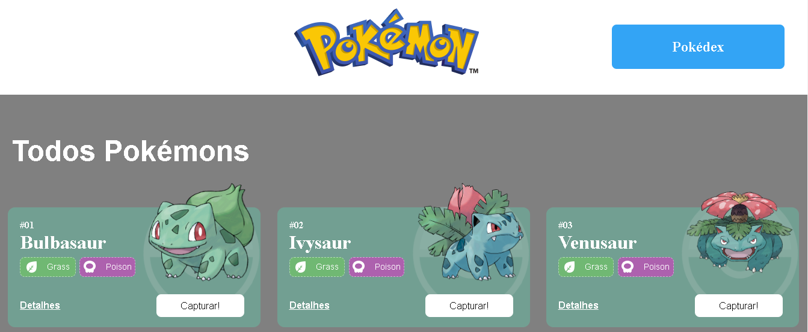

# **Projeto React e API's**

O Projeto React e APIs é um site sobre pokémons que possui três páginas: Home, Pokedex e Detalhes. O projeto está subdivido em temas de acordo com os conteúdos estudados durante o Módulo 2 - Frontend.

Este projeto tem como fonte de dados para a sua criação a [Poke Api](https://pokeapi.co/ "Poke Api"), uma Api pública, muito usada para aplicações focadas em aprendizado de programação e também usada em cases de processos seletivos.

As prinipais ferramentas utilizadas foram:

- Integração de API's
- React Router
- Design Systems
- Estado Global

### Link para o site do Projeto:

### Autora:

[Linkedin - Isabelly Martins](https://www.linkedin.com/in/isabelly-martins/)